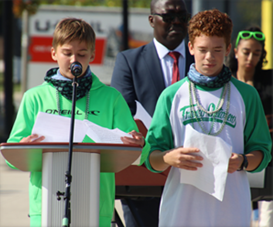

import Patrimoine from "../../../../components/Patriomoine";

Les bénévoles du Griffon accueillaient une vingtaine de partenaires communautaires à leur réunion annuelle générale à l’Auberge Richelieu à Welland, le jeudi 23 novembre dernier. Au programme de la soirée, le secrétaire/trésorier présentait un bilan des nombreuses activités réalisées en 2022 et 2023 en plus des activités à venir avant la fin mars 2024. De plus, il y eu la présentation des événements prévus pour 2024 et 2025 à compter du premier avril. Toujours avec grande transparence, les états financiers étaient également à l’ordre du jour. Ces rencontres régionales sont des moments privilégiés qui permettent aux divers intervenants de partager leurs initiatives. Il est important de souligner que l’ensemble des projets proposés par le Griffon sont réalisés en collaboration avec divers partenaires qui font partie de la collectivité francophone de la péninsule. La communication lors de ces rencontres régionales est fondamentale au succès des initiatives régionales. Parmi les projets d’envergures proposés, la célébration de la St. Jean en famille le 23 juin 2024 à l’auberge demeure un des événements principal au calendrier culturel régional. L’ensemble des partenaires présents étaient d’accord qu’il faut planifier un événement d’envergure pour célébrer en grand le patron de la francophonie canadienne. Par ailleurs, une proposition fut approuvée par l’ensemble des partenaires de créer un comité organisateur pour la St. Jean 2024. Enfin, les gens ont quitté la réunion emballés prêts à collaborer dans la réalisation d’activités qui répondront aux francophones et aux francophiles des 4 coins de la péninsule.

<Patrimoine msg="Ces rencontres régionales sont possibles grâce à l’appui financier de Patrimoine Canada." />