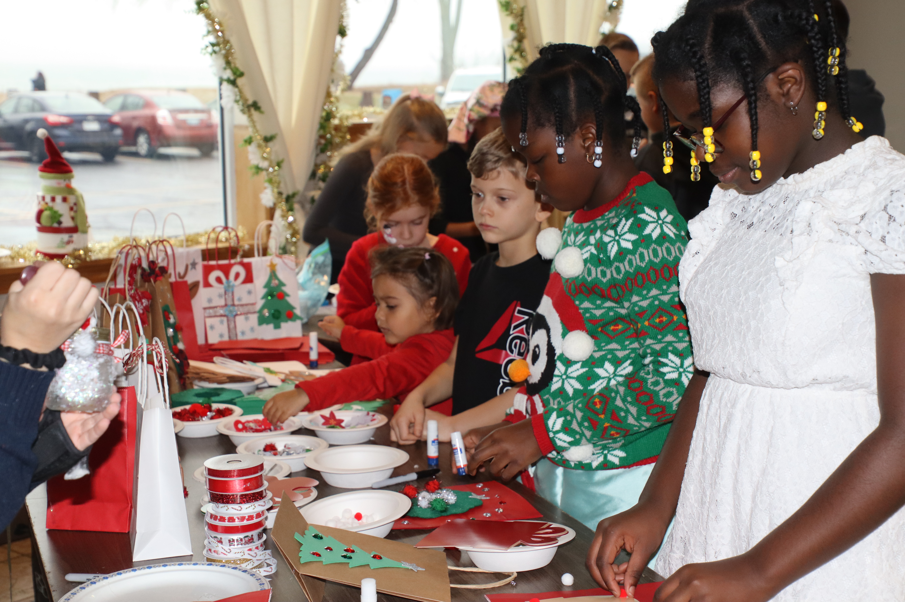
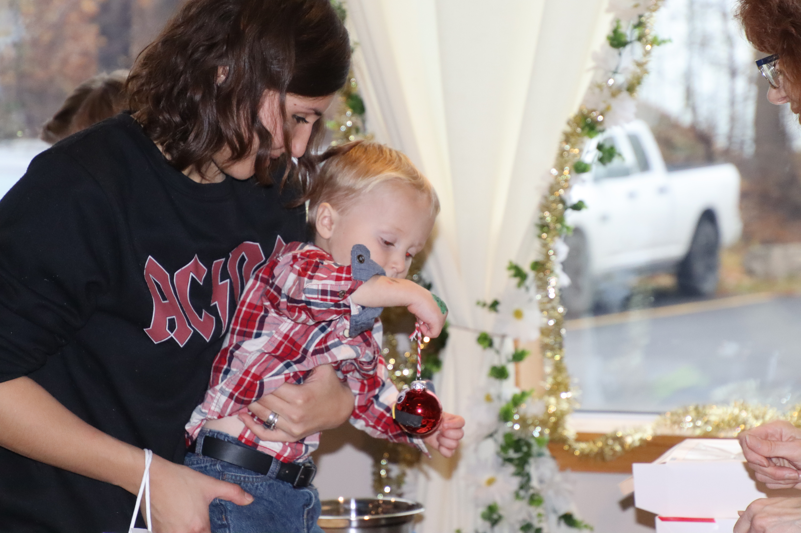
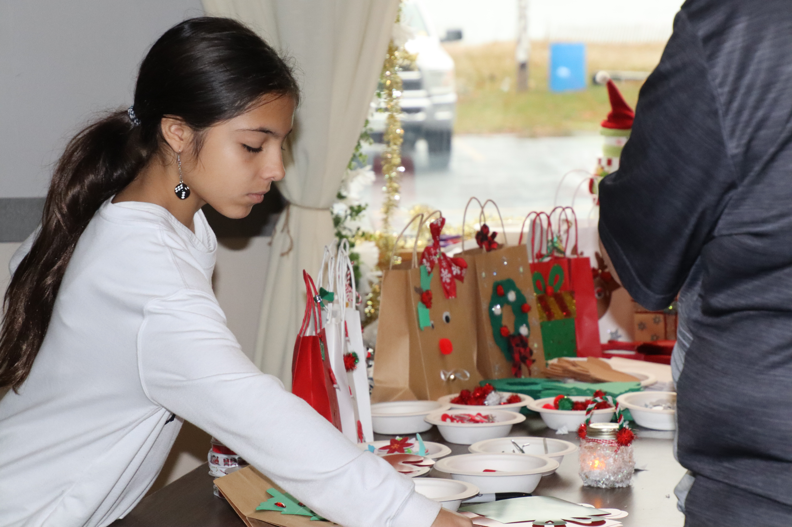

import {Carousel} from "react-bootstrap";
import Patrimoine from "../../../../components/Patriomoine";

<Carousel className="mb-3">
<Carousel.Item>

</Carousel.Item>
<Carousel.Item>

</Carousel.Item>
<Carousel.Item>

</Carousel.Item>
<Carousel.Item>

</Carousel.Item>
<Carousel.Item>

</Carousel.Item>
<Carousel.Item>

</Carousel.Item>
<Carousel.Item>

</Carousel.Item>
<Carousel.Item>

</Carousel.Item>
<Carousel.Item>

</Carousel.Item>
<Carousel.Item>

</Carousel.Item>
<Carousel.Item>

</Carousel.Item>
<Carousel.Item>

</Carousel.Item>
<Carousel.Item>

</Carousel.Item>
</Carousel>

La tradition de Noël des petits en famille demeure une activité très populaire au sein de notre communauté. De fait il s’agit d’un après-midi rempli pour les petits et les grands ainsi que l’occasion parfait pour les retrouvailles. Dès leur arrivée au Club, les petits se sont embarqués dans des activités de bricolage avec l’aide de nos élèves de l’école Immaculée, Mia Velez, Evelyn Beatty, Vienna Counsell, Serenity Mawaya, Joshua Gale-David et Joël Kinney. Comme toujours, ils étaient très fiers de leurs productions artistiques. Toujours populaire avec les petits comme les grands, Alez Kazam a émerveillé la foule avec ses tours de magie. Que de mieux que des chansons de Noël dans l’arrière-plan, interprétées par Suzanah Taylor. Et finalement, le moment tant attendu par les petits, l’arrivée du Père Noël et de Mère Noël. Telle une scène dans un grand livre d’histoire de Noël, les petits se rassemblent autour de ce gentilhomme vêtu de rouge et de blanc pour écouter à un compte de Noël. Tour à tour, ils s’assoient sur le genou du joyeux vieil elf pour recevoir un joli cadeau. Pour couronné l’après-midi, on s’assoit en famille pour la collation. Ces moments que l’on passe en famille au Club contribuent au sentiment d’appartenance de notre communauté à la collectivité franco-ontarienne.

<Patrimoine msg="Enfin, ces moments spéciaux sont possible grâce à l’appui financier de Patrimoine Canada." />