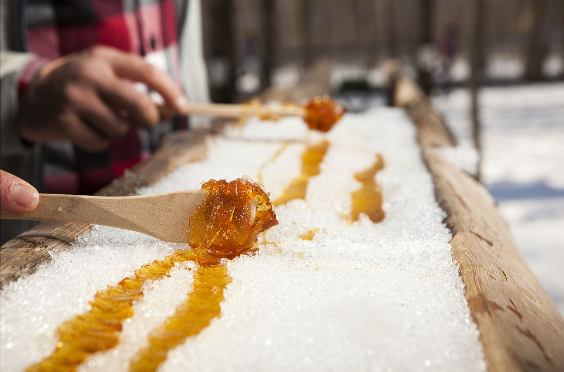
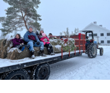
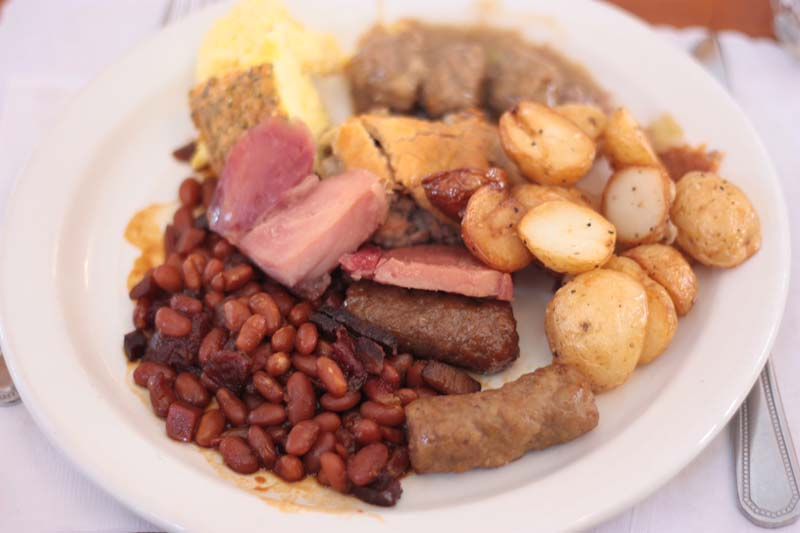

import Patrimoine from "../../../../components/Patriomoine";

### Le samedi 3 février 2024 de 9h30 à 14h au Club La Salle

_Œufs brouillés, jambons, saucisses, fèves au lard, petites patates au four, (toast), crêpes garnies de sirop d’érable, tire d’érable sur de la neige)_

#### Coût - 15$

### Hay ride, activités pour les petits et les grands

### Spectacles
- Gilles Groleau présente un répertoire de musique française

- Simon et Malcolm Hauber présentent des jigs et des reels

- Musique dansante avec John Libra à compter de midi

### Veuillez acheter votre billet à l’avance

- Micheline Belleau 289-213-1060
- Monique à la paroisse 905-934-4266

<Patrimoine />