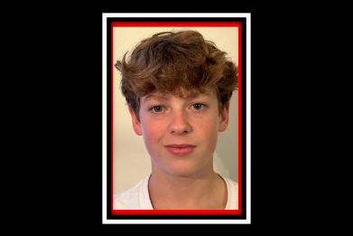

Durant la période des fêtes, Cade Bovine fait partie de l’équipe de hockey U16 de Niagara qui représente le Canada au tournoi international qui aura lieu en Suède, au Danemark et en Norvège.  Fier francophone, Cade portera le drapeau fanco-ontrien sur son gilet. Cade fait partie de cette équipe élite qui porte le drapeau canadien avec honneur. Hommage à ce jeune franco-ontarien fier de son héritage et de la tradition des hockeyeurs canadiens français.