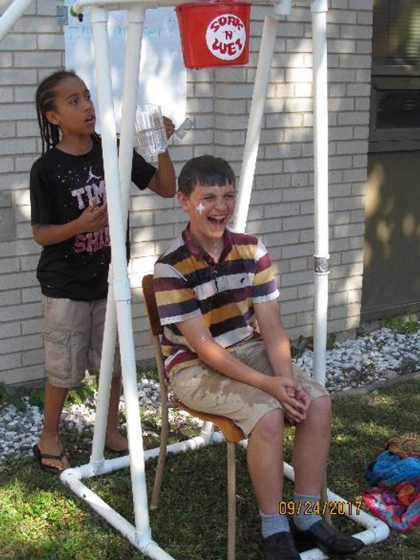

Le Griffon animait en collaboration avec le Club des Bons Vivants, le Richelieu, les Hommes Catholiques, les Dames Chrétiennes, les Chevaliers de Colomb et les Filles d’Isabelle la Franco fête du 24 septembre dernier au centre Immaculée-Conception.  Il s’agissait d’une fête communautaire préparée dans le cadre de la levée officielle du drapeau Franco-Ontarien à laquelle nous avons accueilli 300 participants.  Le barbecue communautaire, les jeux gonflables, les activités pour les petits et les grands ont contribué au grand succès de la fête.  Les nombreux bénévoles étaient très heureux de la réussite  de l’activité puisque les gens se sont bien amusés.

La foule s’est rassemblée autour du drapeau à 13h pour écouter à l’historique de la levée initiale du drapeau qui fut déployé officiellement pour la première fois le 25 septembre 1975 à l'Université Laurentienne à Sudbury.  Le vert du drapeau est celui de nos étés, le blanc celui de nos hivers, la fleur-de-lis traduit notre appartenance à la francophonie mondiale et la fleur-de-trille nous identifie en même temps comme Ontariens et Ontariennes à part entière expliquait  Jean Chartrand, un bénévole du Griffon.

Ensemble, les participants ont chanté avec beaucoup d’émotion, Je te chante mon beau drapeau.

L’esprit de collaboration des organismes francophones de la Péninsule contribue au succès des projets communautaires entrepris.