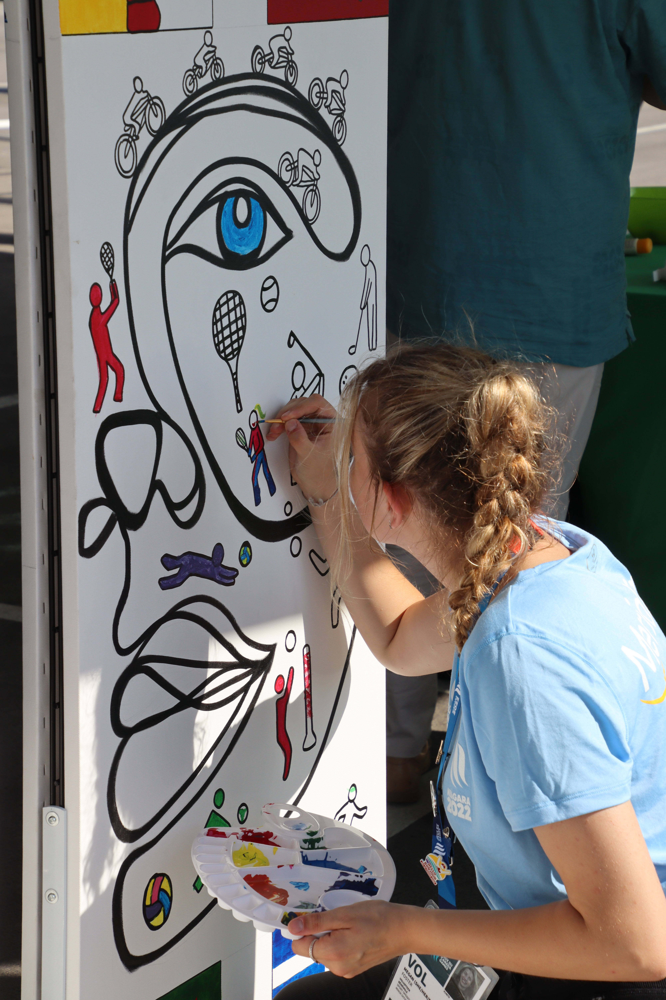
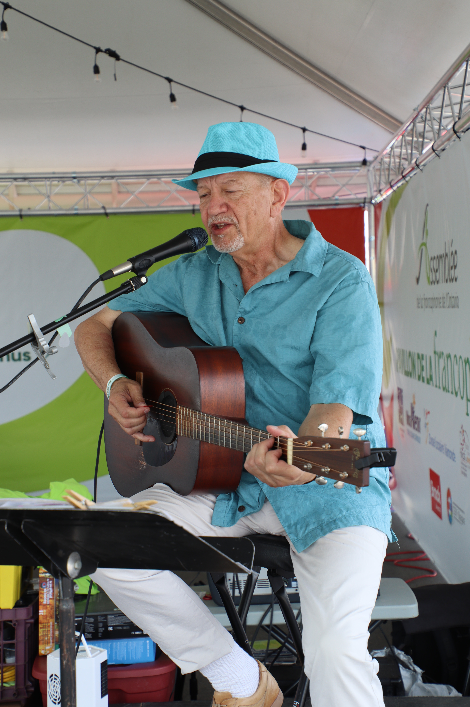
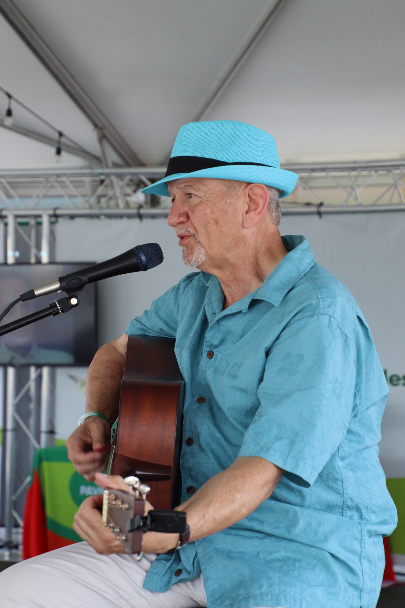

Venez nous visiter au Pavillon de la Francophonie aux Jeux d’été du Canada à chaque jour jusqu’au 22 août 2022, de 10h à 18h.

<h2 className="pt-5">Les arts</h2>

<h2 className="pt-5">Le pavillon</h2>

<h2 className="pt-5">Parade des médailles</h2>

<h2 className="pt-5">Autres photos des Jeux du Canada</h2>

