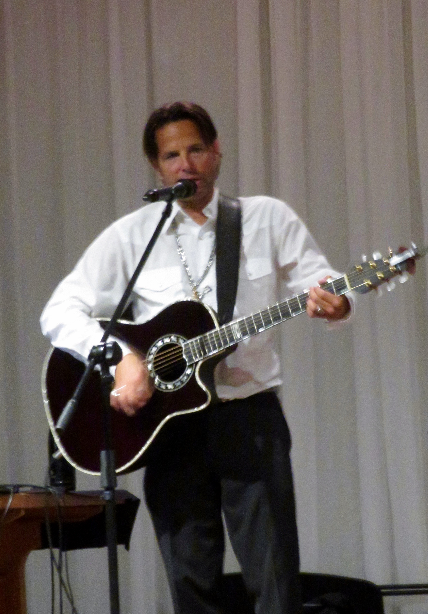

Le dimanche 6 octobre, le Centre communautaire le Griffon et le Club les Bons Vivants organisaient un souper spectacle pour 120 invités au Club La Salle.

Au programme, un délicieux repas servi par des membres bénévoles pendant que Suzannah Taylor présentait des chansons de son répertoire.

À 19 heures, Rémy Langlois, chanteur et guitariste, a donné un spectacle incroyable d’une durée de presque deux heures sans entracte. Il a vite démontré sa belle voix puissante de baryton à ténor, son talent de guitariste et sa grande habileté d’imitateur. En scène, il nous a fait découvrir une gamme de chansons auxquelles nous avons reconnu : Ginette Reno, Gilbert Bécaud, Francis Cabrel, Robert Charlebois (Je t’aime comme un fou), Marc Hervieux, Édith Piaf, Johnny Cash (Folsom Prison Blues), Roch Voisine, Céilne Dion et Michel Pagliaro qu’il prend plaisir à imiter tant par la voix que les gestes. Rémy a fait preuve de charisme en se déplaçant dans la salle pour interagir avec son auditoire. Il a su impliquer les gens qui ont participé activement en chantant et surtout en dansant. Plein d’énergie, Rémy a fait preuve de ses nombreux talents.

Il nous a coupé le souffle avec sa dernière chanson, « Con te partiro », d’Andrea Bocelli.
Quelle belle soirée pour les gens de St. Catharines et la quarantaine d’invités du Club Renaissance de Welland qui sont venus en autobus.